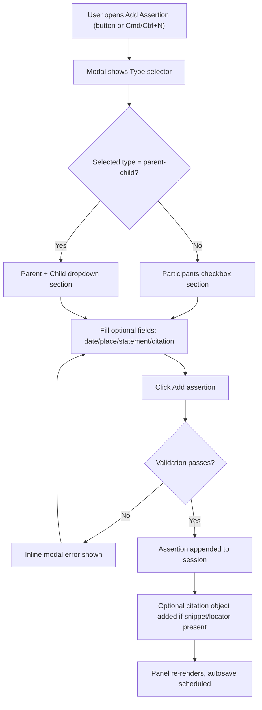

# Add Assertion Flow

## Scope
This document maps the current Add Assertion user flow in the Lineage Session panel, highlights permutations, and captures specification gaps requiring clarification.

References:
- `src/views/session-view.ts`
- `docs/ui-spec.md`
- `docs/specs/assertion-model.md`
- `todos/013-pending-p2-fix-record-type-dropdown-clipping.md`
- `todos/014-pending-p1-fix-add-assertion-participants-visibility.md`
- `todos/015-pending-p2-add-person-flow-from-parent-child-modal.md`

## User Flow Overview

### Flow 1: Non-parent-child assertion (happy path)
1. User opens modal.
2. Chooses type: `identity`, `birth`, `death`, `marriage`, `residence`, or `freeform`.
3. Selects at least one participant.
4. Fills optional fields.
5. Submits.
6. Assertion is added; citation is created if citation fields are populated.

### Flow 2: Parent-child assertion (happy path)
1. User opens modal.
2. Chooses `parent-child`.
3. Selects distinct `Parent` and `Child`.
4. Optionally fills statement/date/place/citation fields.
5. Submits.
6. Assertion is added with `parent_ref`/`child_ref`.

### Flow 3: Validation failure path
- Non-parent-child with zero participants: error `Select at least one participant.`
- Parent-child missing either role: error `Select both a parent and a child.`
- Parent-child same person in both roles: error `Parent and child must be different people.`

### Flow 4: Cancellation path
- User clicks `Cancel`; modal closes; no assertion changes.

## Flow Permutations Matrix

| Dimension | Variant | Current behavior |
|---|---|---|
| Entry point | Add Assertion button | Opens modal |
| Entry point | Cmd/Ctrl+N | Opens modal when session panel is focused |
| Assertion type | parent-child | Uses parent/child dropdowns |
| Assertion type | non-parent-child | Uses participants checkbox list |
| Person availability | 0 persons | Modal opens but assertion cannot be completed |
| Person availability | 1 person | Parent-child cannot be completed (needs distinct two) |
| Person availability | 2+ persons | All assertion types can be completed |
| Citation input | empty | No citation object added |
| Citation input | snippet and/or locator set | Citation object added with next `cN` id |
| Modal action | Cancel | No data change |
| Modal action | Submit with invalid inputs | Inline error; modal remains open |

## Missing Elements & Gaps

### Category: Participant Entry Availability
- Gap: No direct add-person path from Add Assertion modal when no people exist.
- Impact: User must cancel and re-enter flow; high friction and flow break.
- Current ambiguity: Whether modal should support inline person creation or guided return.

### Category: Non-parent-child Participant Visibility
- Gap: Reported regression where participants section is not visible for non-parent-child types.
- Impact: Core assertion entry blocked for most types.
- Current ambiguity: Whether issue is toggle logic, CSS clipping, or both.

### Category: Dropdown Rendering/Clipping
- Gap: Reported dropdown clipping in session and assertion modal selectors (`Record type`, assertion `Type`, assertion `Sex`).
- Impact: Selection controls are hard/impossible to use in narrow panel/modal contexts.
- Current ambiguity: Root cause likely overflow/stacking context, but exact container interaction is unspecified.

### Category: Validation Contract
- Gap: Assertion-level validation is modal-local only; no explicit spec for minimum required fields per assertion type beyond participants/roles.
- Impact: Inconsistent quality of assertions can enter session (for example, no citation, date, or statement).
- Current ambiguity: Whether citations should be required for all typed assertions.

### Category: Recovery/Resumption
- Gap: No explicit behavior for preserving partially entered assertion data when user must navigate to add people.
- Impact: User rework and potential data loss in complex assertions.
- Current ambiguity: Should draft assertion fields persist across modal transitions.

### Category: Accessibility
- Gap: No explicit spec for keyboard traversal and announcements inside Add Assertion modal.
- Impact: Inconsistent accessibility and discoverability of validation errors.
- Current ambiguity: whether to add `aria-describedby` per invalid control and focus management on first failing field.

## Critical Questions Requiring Clarification

### Critical
1. When assertion requires participants but session has zero persons, what is the required UX?
- Why it matters: Current flow is effectively blocked.
- Assumption if unanswered: Add inline `Add person` CTA in modal and return to assertion form.

2. Should non-parent-child assertion entry be blocked from release until participants visibility regression is fixed?
- Why it matters: This is a functional blocker for core assertion types.
- Assumption if unanswered: Treat as release-blocking defect.

3. Should dropdown clipping issues in session and modal selectors be treated as one shared defect with a common CSS/layout fix?
- Why it matters: Same rendering issue appears in multiple controls.
- Assumption if unanswered: Fix at shared container/layout level first.

### Important
4. For typed assertions (`identity`, `birth`, `death`, `marriage`, `residence`, `parent-child`), is citation required at creation time?
- Why it matters: Data quality and projection reliability.
- Assumption if unanswered: Keep citation optional in UI, enforce later during projection review.

5. Should assertion modal preserve entered values when navigating away to add a person?
- Why it matters: Prevents re-entry friction.
- Assumption if unanswered: Preserve by default if technically feasible.

6. Should parent-child require at least two distinct people before opening modal, with pre-check guidance?
- Why it matters: Faster recovery and clearer expectations.
- Assumption if unanswered: Show in-modal guidance plus quick add-person path.

### Nice-to-have
7. Should type-specific helper text be added (for example, `identity` expects `name` and optional `sex`)?
- Why it matters: Reduces entry ambiguity and later cleanup.
- Assumption if unanswered: Keep current minimal labeling.

8. Should keyboard hints (`Enter to submit`, `Esc to cancel`) be shown in modal footer?
- Why it matters: Improves discoverability.
- Assumption if unanswered: Defer to later UX polish pass.

## Recommended Next Steps
1. Resolve blocking modal issues first:
- `todos/014-pending-p1-fix-add-assertion-participants-visibility.md`
- `todos/013-pending-p2-fix-record-type-dropdown-clipping.md`

2. Implement person-creation recovery flow:
- `todos/015-pending-p2-add-person-flow-from-parent-child-modal.md`

3. Add explicit acceptance criteria to `docs/ui-spec.md` for:
- Add Assertion behavior when person count is 0 or 1
- Dropdown rendering requirements in panel + modal
- Accessibility behavior for modal validation and focus

4. After fixes, run manual QA matrix:
- each assertion type
- person counts 0, 1, 2+
- button + keyboard entry points
- dark/light theme and narrow width
