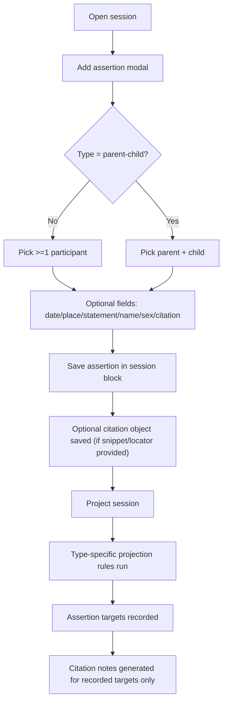

# Assertion Model Spec (Current Functionality)

This document describes the assertion model as it is currently implemented in code.

Verified against:
- `src/views/session-view.ts`
- `src/session-manager.ts`
- `src/projection/projection-engine.ts`
- `src/projection/rules/*.ts`
- `src/conflict-detector.ts`
- `test/projection-*.test.ts`

## User Flow Overview

### Flow 1: Assertion Entry (UI)
1. User opens `Add assertion`.
2. User selects one of: `identity`, `birth`, `death`, `marriage`, `parent-child`, `residence`, `freeform`.
3. Validation on submit:
   - `parent-child`: requires both `parent_ref` and `child_ref`, and they must differ.
   - all other types: requires at least one `participants` entry.
4. Assertion is appended to `session.assertions` with ID `aN` (sequential, not UUID).
5. If citation snippet or locator is present, a `cN` citation record is also created and linked from assertion `citations: [cN]`.

### Flow 2: Session Parse/Load
1. Session parser requires assertion `id` and `type` as strings.
2. All other assertion fields are optional at parse time.
3. Unknown assertion `type` values are accepted and preserved.

### Flow 3: Projection
1. Projection engine runs rules in fixed order: `identity` -> `birth/death` -> `marriage` -> `parent-child` -> `residence` -> `citations`.
2. Only known typed assertions create projection targets.
3. Citation projection only runs against assertion IDs that produced targets.

### Flow 4: Conflict Detection
1. `detectConflicts()` groups by `(participant.person_ref, assertion.type)`.
2. Duplicates are classified as `high` (`birth`/`death`), `medium` (`marriage`), else `low`.
3. This logic is not currently wired into session UI rendering.

## Flow Permutations Matrix

### Type Behavior Matrix

| Assertion type | UI allows create | Projection output | Projection validation behavior |
|---|---|---|---|
| `identity` | yes | person note (create/update) | missing participant person_ref logs error; empty participants silently no-op |
| `birth` | yes | event note (+ person/place as needed) | empty participants silently skipped; missing participant person_ref logs error |
| `death` | yes | event note (+ person/place as needed) | same behavior as `birth` |
| `marriage` | yes | relationship note (`spouse`); event note only when date or place exists | fewer than 2 participants silently skipped; missing participant person_ref logs error |
| `parent-child` | yes | relationship note (`parent-child`) | missing refs, same ref, or missing persons log error and skip |
| `residence` | yes | event note (`residence`) + place | no participants or missing place logs error and skip |
| `freeform` | yes | none | no projection rule (stored only in session) |
| any other string | parser/manual only | none | accepted by parser, ignored by projection |

### Context Matrix

| Dimension | Variant | Current behavior |
|---|---|---|
| Session people count | 0 | modal opens; no valid assertion can be submitted |
| Citation list on assertion | multiple IDs | only first ID is read for snippet/locator during citation projection |
| Citation source_id | present in citation object | ignored by projection; source note comes from session metadata |
| Device/context | Obsidian desktop panel | single implementation path; no separate mobile/tablet behavior specified |
| Retry after projection errors | user retries projection | reruns same rules; errors remain in summary until data corrected |

## Current Data Contract

| Field | Parse requirement | Runtime notes |
|---|---|---|
| `id` | required string | UI uses sequential `aN` IDs |
| `type` | required string | not enum-validated in parser |
| `participants` | optional array | required by modal for non-parent-child only |
| `parent_ref` | optional string | required only for `parent-child` projection |
| `child_ref` | optional string | required only for `parent-child` projection |
| `citations` | optional string[] | optional; first element only used in projection |
| `date`/`place`/`statement`/`name`/`sex` | optional | accepted as assertion extras; only some fields affect projection |

## Missing Elements & Gaps

| Category | Gap Description | Impact | Current Ambiguity |
|---|---|---|---|
| Validation | Parser accepts unknown assertion types and sparse records | invalid/unsupported records can persist silently | whether unknown types should hard-fail, warn, or be retained intentionally |
| Projection | `freeform` assertions never generate entity or citation targets | evidence can appear captured but never projected | expected behavior for freeform evidence notes is undefined |
| Citation model | only first citation per assertion is used | additional evidence refs are ignored in projection output | whether citations should be 1:N and all rendered |
| Conflict UX | conflict detection exists but is not shown in session UI | users do not get conflict warnings while editing | intended conflict display and action model not defined |
| Error consistency | some invalid typed assertions are silent no-op (`birth`, `death`, `marriage`) while others log errors | inconsistent user feedback and debugging difficulty | whether all typed assertion skips must emit projection errors |
| Source linkage | citation `source_id` is captured in session data but not used in citation projection | potential mismatch between citation record and generated Source note | intended authority between `source_id` and session metadata is unclear |

## Critical Questions Requiring Clarification

### Critical
1. Should unknown assertion types be rejected at parse time?
Why it matters: it determines schema strictness and forward-compatibility strategy.
Default assumption if unanswered: keep permissive parse, but add explicit warning in UI/projection summary.
Example ambiguity: `type: baptism` currently persists but is ignored during projection.

2. Should `freeform` assertions project to citation/evidence notes?
Why it matters: otherwise freeform data is only visible inside session notes.
Default assumption if unanswered: keep non-projecting behavior and document clearly as session-only.
Example ambiguity: `freeform` with citation currently creates a citation object but no citation note.

3. Should all typed assertion projection skips emit an error?
Why it matters: silent skips hide data quality issues.
Default assumption if unanswered: normalize to explicit projection errors for missing required type inputs.
Example ambiguity: `marriage` with one participant is silently skipped today.

### Important
1. Should multiple citation IDs per assertion be supported in projection output?
Why it matters: historical conclusions often require multiple excerpts.
Default assumption if unanswered: preserve current first-citation-only behavior.
Example ambiguity: `citations: [c1, c2, c3]` currently uses only `c1`.

2. Should assertion IDs remain human sequential (`a1`) or move to UUIDs?
Why it matters: affects merge behavior and cross-file references.
Default assumption if unanswered: keep `aN` for UX simplicity.
Example ambiguity: prior docs specified UUID requirement.

3. Should assertion `statement` be projected to entity notes or kept session-only?
Why it matters: statement text is currently captured but dropped in projection.
Default assumption if unanswered: keep session-only until explicit destination fields are designed.

### Nice-to-have
1. Should conflict severity (`high`/`medium`/`low`) drive UI affordances?
Why it matters: provides prioritization cues during review.
Default assumption if unanswered: defer UI integration and keep detector as internal utility.

## Recommended Next Steps

1. Decide strict-vs-permissive assertion schema policy and align parser + UI messaging.
2. Define explicit product behavior for `freeform` projection and multi-citation handling.
3. Normalize projection error semantics so all invalid typed assertions are surfaced consistently.
4. Either wire conflict detection into session UI or remove outdated conflict-UI expectations from docs.
5. Add test coverage for unknown assertion types, first-citation-only behavior, and silent-skip cases.
