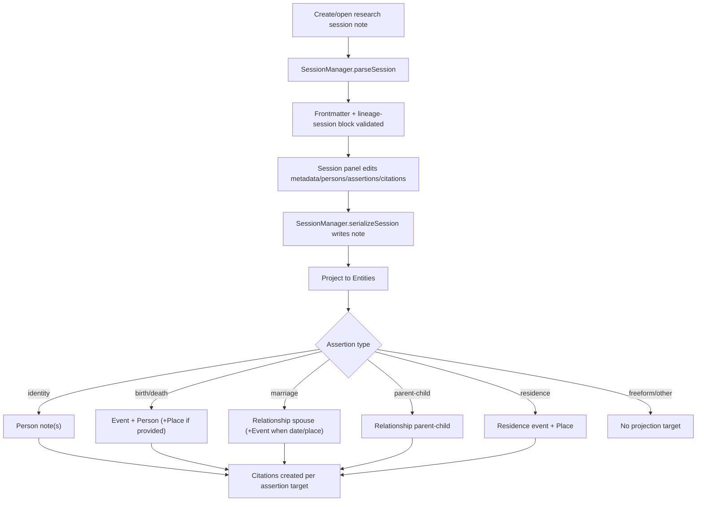

# Data Model Flow (Current State)

## Scope
This document captures the currently implemented data model behavior across session parsing/serialization, session UI writes, and projection output.

Primary references:
- `src/types.ts`
- `src/session-manager.ts`
- `src/views/session-view.ts`
- `src/projection/projection-engine.ts`
- `src/projection/rules/*.ts`
- `src/templates/entity-templates.ts`
- `test/session-manager.test.ts`
- `test/projection-*.test.ts`

### User Flow Overview



Flow 1: Session document parse and in-memory model
1. Parse requires YAML frontmatter and a closed ```lineage-session``` block.
2. Frontmatter contract:
- `lineage_type` must equal `research_session`.
- `title`, `record_type`, `repository`, `locator` must be strings.
- `record_type` must be one of `census|vital|church|probate|newspaper|other`.
- `session_date` is optional and, if present, must be `YYYY-MM-DD`.
- `projected_entities` must be a string array.
3. Session block contract:
- `session.id` is required.
- `session.document` object is required; `url|file|transcription` are optional strings.
- `sources|persons|assertions|citations` default to `[]` if omitted.
- `id` is required for each source/person/assertion/citation item.
- assertion `type` is required; other keys are permissive passthrough.

Flow 2: Session editor writes
1. Add person creates `{ id, name?, sex?, matched_to: null }`.
2. Add assertion writes flexible assertion records with optional fields:
- `participants[]` (`person_ref` entries) or `parent_ref/child_ref` for `parent-child`
- optional `date`, `place`, `statement`, `name`, `sex`
- optional `citations: [cN]`
3. Citation snippets/locators create session-local citation records:
- `{ id: cN, source_id?: string, snippet?: string, locator?: string }`

Flow 3: Projection output model
1. Identity assertions ensure person files and set citation targets to `person`.
2. Birth/death assertions ensure event files (`lineage_type: event`) and principal person targets.
3. Marriage assertions ensure spouse relationship; event created only when `date` or `place` exists.
4. Parent-child assertions ensure relationship with roles parent/child.
5. Residence assertions require participants and place; otherwise errors are logged.
6. Citations create source and citation notes tied to projection targets.

Flow 4: Projection frontmatter by entity type
1. Person:
```yaml
lineage_type: person
lineage_id: <generated>
name: <string>
sex: <optional>
```
2. Event:
```yaml
lineage_type: event
lineage_id: <generated>
event_type: birth|death|marriage|residence
date: <optional string>
place: <optional wikilink>
participants: [<wikilink>, ...]
```
3. Place:
```yaml
lineage_type: place
lineage_id: <generated>
name: <string>
parent_place: <optional>
```
4. Relationship:
```yaml
lineage_type: relationship
lineage_id: <generated>
relationship_type: spouse|parent-child
person_a: <wikilink>
person_b: <wikilink>
person_a_role: <optional>
person_b_role: <optional>
date: <optional>
place: <optional>
```
5. Source:
```yaml
lineage_type: source
lineage_id: <generated>
title: <session metadata title>
record_type: <session metadata record_type>
repository: <session metadata repository>
locator: <session metadata locator>
date: <session metadata session_date, optional>
```
6. Citation:
```yaml
lineage_type: citation
lineage_id: <generated>
source_id: <source lineage_id>
target_entity_id: <target lineage_id>
target_entity_type: person|event|relationship
assertion_id: <session assertion id, e.g. a1>
snippet: <optional>
locator: <optional>
```

### Flow Permutations Matrix

| Dimension | Variant | Current behavior |
|---|---|---|
| Session parser entry | Valid frontmatter + block | Parses into typed `Session` |
| Session parser entry | Missing frontmatter/block | Throws parse error |
| Session block arrays | Missing `sources/persons/assertions/citations` | Defaults to empty arrays |
| Assertion type | `identity` | Person projection target(s) |
| Assertion type | `birth` / `death` | Event + person target; optional place |
| Assertion type | `marriage` | Relationship; optional event if date/place |
| Assertion type | `parent-child` | Parent-child relationship |
| Assertion type | `residence` | Requires place + participants; else summary error |
| Assertion type | `freeform` or unknown | Parsed/stored but ignored by projection rules |
| Person match state | `matched_to` resolvable | Existing person reused/updated |
| Person match state | missing/unresolvable | Falls back to projected-name/lineage/new file |
| Citation source in session | `citations[].source_id` present/absent | Ignored for source linking during projection |
| Filename conflict | Existing entity path | Projection uses ` (2)`, ` (3)` suffixes |
| Session file conflict | Existing `Sessions/YYYY-MM-DD-slug.md` | Session creation uses `-1`, `-2` suffixes |

### Missing Elements & Gaps

**Category**: Schema Strictness and Drift
- **Gap Description**: Runtime model is intentionally permissive for `Source`, `Person`, `Assertion`, and `Citation` objects (`[key: string]: unknown`), while docs imply a strict canonical schema.
- **Impact**: Integrations may assume fields are guaranteed when they are not.
- **Current Ambiguity**: Whether strict schema validation should be enforced pre-save or only at projection time.

**Category**: Session Source vs Projected Source Contract
- **Gap Description**: Session `sources[]` and citation `source_id` are captured but projection source creation is driven from session metadata title/record/repository/locator.
- **Impact**: Two source models coexist; linkage intent can diverge.
- **Current Ambiguity**: Whether session-local `sources[]` should become authoritative or remain informational.

**Category**: Referential Integrity
- **Gap Description**: Parser checks types but does not enforce cross-reference integrity (for example citation IDs in assertions, or participant person refs existing).
- **Impact**: Invalid references are possible until projection logs errors or silently skips.
- **Current Ambiguity**: Whether integrity should be enforced at parse/save boundary.

**Category**: Validation Inconsistency
- **Gap Description**: `SessionManager.validateSession` requires `title` + `session.id` + document capture, while SessionView save validation also requires `record_type`, `repository`, and `locator`.
- **Impact**: Behavior differs by entry point and can surprise API/command callers.
- **Current Ambiguity**: Which validator is canonical.

**Category**: ID Semantics
- **Gap Description**: Docs describe UUID IDs, but implementation uses `crypto.randomUUID()` when available and fallback timestamp-random strings.
- **Impact**: Downstream tooling expecting strict UUID format may break.
- **Current Ambiguity**: Whether fallback IDs are acceptable long-term.

**Category**: Link Stability
- **Gap Description**: Many references rely on basename wikilinks (`[[Name]]`) instead of path-stable links/IDs.
- **Impact**: Ambiguous names can resolve unpredictably in large vaults.
- **Current Ambiguity**: Whether to migrate toward lineage_id-based linking in session state.

**Category**: Projection Coverage
- **Gap Description**: Only specific assertion types project; freeform assertions are stored but not transformed.
- **Impact**: Users may expect all assertions to produce entities/citations equally.
- **Current Ambiguity**: Whether freeform should remain non-projecting or get explicit projection behavior.

### Critical Questions Requiring Clarification

1. **Critical**: Which model is authoritative for source identity: `session.sources[]`, session metadata, or both?
- Why it matters: Prevents conflicting source lineage in projected citations.
- Assumption if unanswered: Keep metadata-driven source generation as canonical.
- Example ambiguity: assertion cites `source_id: s3`, but projection source note is created from session title.

2. **Critical**: Should referential integrity be enforced before save/project (participants, parent/child refs, citation IDs)?
- Why it matters: Prevents silent skips and late projection errors.
- Assumption if unanswered: Continue permissive parse with projection-time errors.
- Example ambiguity: assertion contains `participants: [{ person_ref: "p999" }]`.

3. **Critical**: Do we require strict UUID format for `lineage_id` and `session.id`?
- Why it matters: Interop and migration tooling often assume UUID shape.
- Assumption if unanswered: Accept current UUID-or-fallback behavior.
- Example ambiguity: environments without `crypto.randomUUID`.

4. **Important**: Should `SessionManager.validateSession` be aligned with SessionView submit validation?
- Why it matters: Consistent behavior across commands, tests, and UI.
- Assumption if unanswered: Keep dual behavior (manager minimal, UI strict).
- Example ambiguity: CLI projection path accepts sessions UI would reject.

5. **Important**: Should `freeform` assertions be explicitly documented as non-projecting?
- Why it matters: User expectation and test coverage clarity.
- Assumption if unanswered: Keep current non-projecting behavior.
- Example ambiguity: freeform assertion with citation exists but no target files, so no citation note.

6. **Important**: Should `matched_to` store stable identity (path or lineage_id) instead of display-name wikilink?
- Why it matters: Avoid accidental mis-resolution in duplicate-name vaults.
- Assumption if unanswered: Keep name-link storage.
- Example ambiguity: two `[[John Smith]]` notes in different folders.

7. **Nice-to-have**: Should session creation location (`Sessions/`) and entity base folder (`Lineage/` by setting) be unified?
- Why it matters: Cleaner information architecture and export/discovery.
- Assumption if unanswered: Keep current split storage model.
- Example ambiguity: users expect all Lineage artifacts under configured base folder.

8. **Nice-to-have**: Should source/citation creation counts be explicit in `ProjectionSummary`?
- Why it matters: Better operational visibility for large projections.
- Assumption if unanswered: Keep only created/updated path lists + entity counters.
- Example ambiguity: summary reports no dedicated source/citation counters despite file creation.

### Recommended Next Steps
1. Define a canonical schema contract document separating:
- parse-level requirements
- save-level validation
- projection-level requirements
2. Decide source model ownership (`session.sources[]` vs metadata) and align citation linking to that contract.
3. Add integrity checks for cross-references (participants, parent/child, citations) with explicit error surfaces.
4. Clarify and test ID format guarantees (`lineage_id`, `session.id`) across runtime environments.
5. Publish explicit projection coverage table by assertion type, including non-projecting types.
6. If stable linking is a goal, design migration from name-based wikilinks to lineage_id/path-backed references.

## Implemented Contract Update (2026-02-12)

- Save/project boundaries now enforce referential integrity:
  - assertion participants must reference existing session persons
  - parent/child refs must exist and be distinct for `parent-child`
  - assertion citation IDs must exist in session citations
- Session ID policy is now explicit in runtime behavior:
  - UUID preferred
  - fallback IDs accepted
  - invalid/empty IDs are blocking
- Projection summaries now surface non-projecting assertion coverage notes (for example `freeform`) so behavior is explicit.
