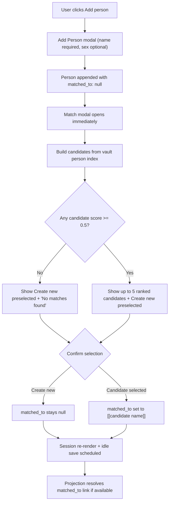

# Duplicate Matching Flow (Current State)

## Scope
This document reflects the currently implemented duplicate-matching behavior in the Lineage session view and projection pipeline.

Primary implementation references:
- `src/views/session-view.ts`
- `src/duplicate-matcher.ts`
- `src/projection/helpers.ts`
- `src/vault-indexer.ts`
- `test/duplicate-matcher.test.ts`

## User Flow Overview

### Flow 1: Add person and open matching
1. User adds a person from the Session panel.
2. Person is inserted into session state with `matched_to: null`.
3. `Match person` modal opens immediately after add.

### Flow 2: Candidate generation and ranking
1. Candidates come from `vaultIndexer.getPersonEntries()` (notes with `lineage_type: person` and non-empty `name`).
2. Current feature inputs in session view are:
   - `name = scoreName(person.name, entry.name)`
   - `date = 0.5` (constant neutral value)
   - `place = 0`
   - `relationship = 0`
3. Composite score formula (from `computeCompositeScore`) is:
   - `name * 0.4 + date * 0.25 + place * 0.25 + relationship * 0.1`
4. Session view keeps candidates where score `>= 0.5`, sorts descending, and limits to 5.

### Flow 3: User decision
1. Modal defaults to `Create new person (no match)`.
2. If user confirms `Create new`, `matched_to` remains `null`.
3. If user confirms a candidate, `matched_to` is set to `[[candidate.name]]`.

### Flow 4: Downstream projection behavior
1. During projection, `ensurePersonFile` first tries resolving `matched_to` as a wikilink.
2. If resolved, that file is updated/reused.
3. If not resolved, projection falls back to:
   - existing projected entity by normalized person name
   - then lineage_id match (if provided in session person)
4. If no match is found, a new person note is created.

## Flow Permutations Matrix

| Dimension | Variant | Current behavior |
|---|---|---|
| Trigger | Add person | Match modal opens automatically |
| Trigger | Edit existing person | No rematch trigger in current UI |
| Trigger | Manual refresh request | No explicit refresh action implemented |
| Candidate availability | No vault person entries | Empty state; create new remains selected |
| Candidate availability | 1+ entries but all below threshold | Same as no matches |
| Candidate availability | 1+ entries at/above threshold | Up to 5 shown, highest score first |
| User choice | Create new (default) | `matched_to = null` |
| User choice | Select candidate | `matched_to = [[candidate.name]]` |
| Projection resolution | `matched_to` resolves to file | Existing person file reused/updated |
| Projection resolution | `matched_to` does not resolve | Name/lineage fallback or new file creation |

## Missing Elements & Gaps

### Category: Trigger Coverage
- **Gap Description:** Matching runs only at person creation time.
- **Impact:** Users cannot re-evaluate matches after edits, new vault data, or mistaken prior decisions.
- **Current Ambiguity:** Whether rematching should be automatic, manual, or both.

### Category: Feature Completeness
- **Gap Description:** Date/place/relationship are weighted in shared scoring but not populated in session-view candidate building.
- **Impact:** Real ranking is effectively name-only with a fixed date baseline.
- **Current Ambiguity:** Whether current behavior is intentional MVP scope or incomplete integration.

### Category: Candidate Identity Safety
- **Gap Description:** Candidate selection is stored as `[[candidate.name]]` rather than a path-stable identifier.
- **Impact:** Ambiguous names can resolve to the wrong file, especially with duplicate person names.
- **Current Ambiguity:** Whether `matched_to` should store filename/path wikilink, lineage_id, or another stable reference.

### Category: Threshold Sensitivity
- **Gap Description:** With fixed `date=0.5`, `place=0`, `relationship=0`, score threshold `>= 0.5` implies `nameScore >= 0.9375`.
- **Impact:** Many plausible near-matches are filtered out.
- **Current Ambiguity:** Whether this strictness is desired for precision or unintentionally suppresses recall.

### Category: User Guidance and Recovery
- **Gap Description:** Modal preselects `Create new`, and unmatched states are only visible as row status later.
- **Impact:** Users can unintentionally skip strong matches with a single confirm click.
- **Current Ambiguity:** Whether high-confidence candidates should become default selection or require explicit acknowledgement before creating new.

### Category: Observability
- **Gap Description:** No explicit warning when stored `matched_to` stops resolving later (rename/delete/path changes).
- **Impact:** Silent drift can lead to unexpected new person creation at projection time.
- **Current Ambiguity:** Whether unresolved matches should surface as blocking errors or non-blocking warnings.

## Critical Questions Requiring Clarification

### Critical
1. What is the canonical identifier contract for `matched_to`?
- Why it matters: It controls data integrity during projection.
- Assumption if unanswered: Keep wikilink-by-name and rely on Obsidian resolution behavior.
- Example ambiguity: Two notes named "John O'Connor" in different folders.

2. Should unresolved `matched_to` be surfaced before projection?
- Why it matters: Prevents silent fallback/new-file creation from stale links.
- Assumption if unanswered: Continue current non-blocking fallback behavior.
- Example ambiguity: Matched note renamed after session capture.

3. Is the strict effective threshold (`nameScore >= 0.9375`) intentional?
- Why it matters: Determines recall/precision balance and user trust in suggestions.
- Assumption if unanswered: Keep current threshold and ranking behavior.
- Example ambiguity: "Jon O Connor" vs "John O'Connor" may be excluded.

### Important
4. Should users be able to re-open matching for existing session persons?
- Why it matters: Correctability and long-session workflows.
- Assumption if unanswered: Matching remains add-time only.
- Example ambiguity: User adds candidate person notes after initial session entry.

5. Should date/place/relationship scoring be implemented in session view now or deferred?
- Why it matters: Current formula advertises dimensions that are not active in this flow.
- Assumption if unanswered: Treat non-name dimensions as future work.
- Example ambiguity: Two same-name candidates in different places are currently indistinguishable.

6. Should `Create new` remain default-selected when candidates exist?
- Why it matters: Affects duplicate prevention vs user speed.
- Assumption if unanswered: Keep create-new default.
- Example ambiguity: User presses confirm quickly and bypasses a high-confidence match.

### Nice-to-have
7. Should candidate rows include disambiguators (path, lineage_id, key facts)?
- Why it matters: Helps users choose safely among same-name records.
- Assumption if unanswered: Keep current name + score + breakdown only.
- Example ambiguity: Two "Mary Kelly" candidates with no visible differentiator.

8. Should match decisions be auditable (timestamp/reason/reviewer)?
- Why it matters: Supports review workflows and correction history.
- Assumption if unanswered: Keep only current `matched_to` state.
- Example ambiguity: Hard to determine why a person was matched months later.

## Recommended Next Steps
1. Define `matched_to` persistence contract (name link vs path link vs lineage_id) and align parse/serialize/projection expectations.
2. Add a rematch action on each session person row and optional bulk "Refresh matches" command.
3. Either wire real date/place/relationship features into `buildMatchCandidates` or remove those dimensions from this spec until implemented.
4. Decide and tune ranking defaults (threshold, candidate limit, default radio selection) with acceptance criteria for false positives/false negatives.
5. Add targeted tests for ambiguous same-name candidates, unresolved `matched_to`, and rematch behavior once implemented.

## Implemented Update (2026-02-12)

- Existing session-person rows now provide a direct `Match`/`Rematch` action.
- The rematch action reuses the same match modal and candidate selection flow used at add-time.
- User-selected candidates still persist through `matched_to` in current wikilink form, so projection behavior is unchanged.
- This closes the prior UI gap where matching could only be done at creation time.
