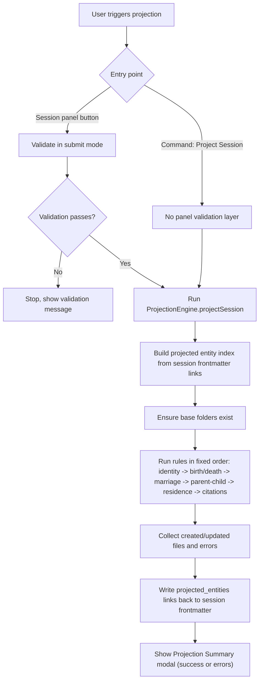

# Projection Rules (Current Implementation Spec)

## Scope
This spec documents the projection behavior as currently implemented in the plugin codebase, with flow analysis and identified gaps.

Primary references:
- `src/projection/projection-engine.ts`
- `src/projection/helpers.ts`
- `src/projection/rules/identity.ts`
- `src/projection/rules/birth-death.ts`
- `src/projection/rules/marriage.ts`
- `src/projection/rules/parent-child.ts`
- `src/projection/rules/residence.ts`
- `src/projection/rules/citations.ts`
- `src/views/session-view.ts`
- `src/commands.ts`

## User Flow Overview

### Flow 1: Session panel projection (happy path)
1. User opens a valid research session in Lineage Session panel.
2. User clicks `Project to Entities`.
3. Required + conditional validation is enforced in panel (`title`, `record_type`, `repository`, `locator`, and one document capture mode).
4. Projection rules run in deterministic order.
5. Summary modal shows created, updated, and error items.

### Flow 2: Command palette projection
1. User runs `Project Session` command against active file.
2. Session is parsed from note frontmatter + `lineage-session` block.
3. Projection runs directly (no session-view form-level validation gate).
4. Notice summarizes counts; errors are logged and included in summary.

### Flow 3: Re-projection
1. Existing `projected_entities` links are read and indexed.
2. Rule-level matching attempts update instead of recreate.
3. `projected_entities` is rewritten from files touched in current run.

### Flow 4: Partial-failure projection
1. Rule-level errors are appended to summary (for example, missing `parent_ref`/`child_ref`).
2. Projection continues for other assertions.
3. User sees mixed created/updated/errors in summary modal.

## Flow Permutations Matrix

| Dimension | Variant | Current behavior |
|---|---|---|
| Entry point | Session panel button | Submit-mode validation before projection |
| Entry point | `Project Session` command | Direct parse + projection |
| Session parse | Valid frontmatter + code block | Projection proceeds |
| Session parse | Missing/invalid structure | Projection aborts with error |
| Assertion type | `identity` | Person create/update; assertion target `person` |
| Assertion type | `birth` / `death` | Person(s) + optional Place + Event; targets `event` + first `person` |
| Assertion type | `marriage` | Two persons required; spouse Relationship; Event only when date/place exists |
| Assertion type | `parent-child` | Requires `parent_ref` and `child_ref`; creates parent-child Relationship |
| Assertion type | `residence` | Requires participants + place; creates Event and Place |
| Assertion type | `freeform` or unsupported | No projection target generated |
| Citation input | `assertion.citations` empty | No citation note for that assertion |
| Citation input | Multiple citation IDs | Only first citation ID is used |
| Entity existence | Match found | Frontmatter updated in place |
| Entity existence | No match | New note created in entity folder |
| Source dedupe | Title + record_type + repository match | Reuses existing source note |
| Source dedupe | Locator differs only | Still reused (locator ignored for match) |

## Rules by Assertion Type (As Implemented)

### 1) Identity -> Person
- Iterates assertion participants.
- Applies assertion-level `name` and `sex` to person only when current person fields are empty.
- Ensures person file exists (matched note, projected entity, lineage_id lookup, or new file).
- Records assertion target as `person`.

### 2) Birth/Death -> Person + Event + optional Place
- Requires at least one participant.
- Ensures person files for participants.
- Creates place only when `place` value exists.
- Creates/updates event (`event_type` birth/death) with participants and optional place/date.
- Records assertion targets:
  - `event` (always when created/updated)
  - `person` (first participant only)

### 3) Marriage -> Relationship + optional Event + optional Place
- Requires at least two participants.
- Ensures two person files.
- Creates/updates spouse relationship (`relationship_type: spouse`).
- Creates marriage event only when `date` or `place` is present.
- Records assertion targets:
  - `relationship` always
  - `event` only when event is created/updated

### 4) Parent-child -> Relationship
- Requires `parent_ref` and `child_ref`.
- Rejects same person for both roles.
- Ensures parent and child person files.
- Creates/updates relationship with roles:
  - `person_a_role: parent`
  - `person_b_role: child`
- Records assertion target `relationship`.

### 5) Residence -> Event + Place
- Requires at least one participant.
- Requires non-empty `place`; otherwise logs error and skips assertion.
- Ensures participants and place.
- Creates/updates residence event.
- Records assertion target `event`.

### 6) Citations -> Source + Citation notes
- Source ensured once per projection run using session metadata.
- Source match key: `title + record_type + repository` (case-insensitive normalization; locator ignored).
- For each assertion target recorded by earlier rules:
  - Resolves target lineage_id (adds one if missing).
  - Creates/updates deterministic citation file name:
    - `Citation - [source title] - [target label] ([assertion id]).md`
  - Writes citation frontmatter:
    - `lineage_type`, `lineage_id`, `source_id`, `target_entity_id`, `target_entity_type`, `assertion_id`, `snippet`, `locator`

## Missing Elements & Gaps

### Category: Trigger and Validation Consistency
- **Gap Description**: Session panel and command path have different validation behavior before projection.
- **Impact**: Users can project from command path with states that panel would block.
- **Current Ambiguity**: Which validation contract is authoritative for projection.

### Category: Assertion Coverage
- **Gap Description**: `freeform` assertions produce no projection targets and therefore no citations.
- **Impact**: Evidence in freeform assertions is not projected as citation artifacts.
- **Current Ambiguity**: Desired target for freeform evidence (person/event/session-only).

### Category: Citation Multiplicity
- **Gap Description**: Only the first `assertion.citations[]` entry is used.
- **Impact**: Multi-citation evidence chains are silently truncated.
- **Current Ambiguity**: Whether one assertion should produce multiple citation notes per target.

### Category: Re-projection Data Safety
- **Gap Description**: Update paths can overwrite existing fields with sparse assertion data (for example, missing date/place on a later run).
- **Impact**: Data loss/regression risk in event/relationship notes.
- **Current Ambiguity**: Merge policy for missing values during updates.

### Category: Relationship Matching Robustness
- **Gap Description**: Marriage relationship matching is order-sensitive (`person_a`, `person_b`).
- **Impact**: Potential duplicate spouse relationships when participant order changes.
- **Current Ambiguity**: Canonical ordering rule for unordered relationship types.

### Category: Citation Filename Stability
- **Gap Description**: Citation filename includes target label; label changes can lead to new citation paths.
- **Impact**: Duplicate citation notes and stale citation files.
- **Current Ambiguity**: Should citation identity be path-based or lineage_id/assertion-based only.

### Category: Transactionality
- **Gap Description**: Projection is multi-step and non-transactional.
- **Impact**: Partial writes can persist when later steps fail.
- **Current Ambiguity**: Required rollback/repair strategy.

### Category: Performance
- **Gap Description**: Source and lineage ID lookups scan markdown files linearly.
- **Impact**: Projection latency can grow with large vaults.
- **Current Ambiguity**: Threshold and plan for indexing/caching.

## Critical Questions Requiring Clarification

### Critical
1. Should projection enforce one shared validation contract across UI and command entry points?
- Why it matters: inconsistent projection preconditions create non-deterministic behavior.
- Default assumption if unanswered: command projection remains permissive.
- Example: command path projects a session missing required metadata fields enforced by panel.

2. What is the authoritative merge strategy on re-projection for missing fields?
- Why it matters: current updates can clear previously captured values.
- Default assumption if unanswered: "latest run wins," including blanks.
- Example: event with date from run A loses date in run B when assertion omits date.

3. Should multi-citation assertions be fully projected?
- Why it matters: evidence completeness and auditability.
- Default assumption if unanswered: first citation only.
- Example: two source snippets for one birth claim project as one citation note today.

### Important
4. Should spouse relationships be canonicalized to avoid order-based duplicates?
- Why it matters: duplicate relationship notes degrade graph quality.
- Default assumption if unanswered: participant order defines identity.
- Example: A-B and B-A assertions create separate spouse notes.

5. Should freeform assertions project citation notes, and if yes, to what target type?
- Why it matters: freeform evidence currently stays trapped in session notes.
- Default assumption if unanswered: no projection for freeform.
- Example: freeform conflict note has citation text but no retrievable citation entity.

6. Should citation filenames be made label-agnostic and ID-stable?
- Why it matters: rename churn can create citation duplication.
- Default assumption if unanswered: keep current deterministic title-based filenames.
- Example: person renamed from "John Smith" to "John A. Smith" produces new citation path.

### Nice-to-have
7. Should projection support resumable/repair mode for partial failures?
- Why it matters: operational safety in large projection batches.
- Default assumption if unanswered: user retries full projection manually.

8. Should source notes merge metadata updates on re-projection?
- Why it matters: newer metadata (locator/date) may never propagate.
- Default assumption if unanswered: existing source remains unchanged except missing lineage fields.

## Recommended Next Steps

1. Define and publish a projection invariants section (validation contract, merge policy, dedupe keys, citation multiplicity).
2. Add explicit tests for re-projection safety (no field clearing without explicit tombstone intent).
3. Decide and implement relationship canonicalization for spouse relationships.
4. Decide freeform assertion projection policy and align docs/UI.
5. Expand citation rule to handle all citation IDs per assertion or explicitly reject extras with surfaced warnings.
6. Add a lightweight index strategy for `lineage_id` and source lookup if vault size exceeds agreed threshold.
7. Keep this spec as implementation source-of-truth and update `docs/projection-rules.md` only as summary.

## Implemented Update (2026-02-12)

- Command palette projection now runs shared validation preflight and blocks projection when blocking errors exist.
- Projection summary contract includes a `notes` collection for intentional non-projection outcomes.
- Projection engine now records coverage notes for unsupported assertion types (including `freeform`), for example: `1 freeform assertion not projected by design.`
- Freeform remains intentionally non-projecting; this is now explicitly surfaced to users in projection summaries.
