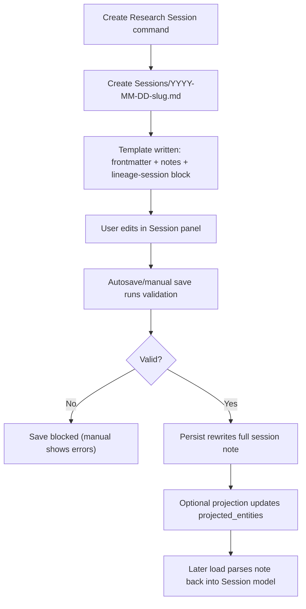

# Research Session Format Flow (Current State)

## Scope
This spec describes the as-implemented research session note format, parse/serialize lifecycle, validation behavior, and projection coupling.

Primary references:
- `src/session-manager.ts`
- `src/templates/session-template.ts`
- `src/views/session-view.ts`
- `src/types.ts`
- `test/session-manager.test.ts`

### User Flow Overview



Flow 1: Session note creation
1. Command prompts for title; blank title cancels creation.
2. File path is `Sessions/<YYYY-MM-DD>-<slug>.md`.
3. Duplicate paths use numeric `-1`, `-2` suffixes.
4. Initial content includes:
- required frontmatter keys
- default notes section (`## Notes`)
- empty `sources/persons/assertions/citations` arrays in `lineage-session` block.

Flow 2: Parse contract when loading/editing
1. Parsing requires:
- YAML frontmatter fence at top of note
- closed ```lineage-session``` fenced block
2. Frontmatter requirements:
- `lineage_type` must be `"research_session"`
- `title`, `record_type`, `repository`, `locator` must be strings
- `record_type` must be one of `census|vital|church|probate|newspaper|other`
- `session_date` optional but must be `YYYY-MM-DD` when present
- `projected_entities` must be a string array
3. Session block requirements:
- `session.id` required string
- `session.document` required object (`url|file|transcription` optional strings)
- each item in `sources/persons/assertions/citations` must have `id`
- assertions require `type`; participants entries require `person_ref`
- additional fields are preserved (passthrough model)

Flow 3: Save and serialization behavior
1. Session panel edits in-memory session data and saves to same file.
2. Save rewrites full note as:
- frontmatter
- `freeformNotes` section (trimmed; defaults to `## Notes` if empty)
- `lineage-session` block
3. Session panel validation for save requires:
- title, record type, repository, locator
- at least one document capture field (`url|file|transcription`)
- valid URL format when URL is provided
- vault file existence when file path is provided
4. Manual save shows errors; autosave uses silent validation and skips invalid writes.

Flow 4: Projection coupling
1. Projection runs from parsed session model and may update session frontmatter:
- `projected_entities` replaced with sorted generated links.
2. Session-local IDs (`p1`, `a1`, `c1`) are not converted into global UUIDs in session note.
3. Citation notes use assertion IDs as `assertion_id` and source `lineage_id` as `source_id`.

### Flow Permutations Matrix

| Dimension | Variant | Current behavior |
|---|---|---|
| Entry point | Create command | Writes template into `Sessions/` |
| Entry point | Open existing note | Parsed only if both frontmatter and session block exist |
| File path conflict | Existing same date+slug file | Creates `-1`, `-2` variants |
| Parse result | Missing frontmatter/session block | Session panel shows placeholder |
| Parse result | Invalid YAML/schema type | Error UI + notice |
| Save trigger | Manual save | Submit-mode validation + visible errors |
| Save trigger | Autosave/idle save | Silent validation; invalid state not persisted |
| Document capture | Any of URL/file/transcription set | Passes document presence check |
| Document capture | None set | Save blocked |
| URL format | Valid URL | Accepted |
| URL format | Invalid URL string | Save blocked |
| File path | Existing vault file | Accepted |
| File path | Non-existent file | Save blocked |
| Assertion format | Known types (`identity`, `birth`, etc.) | Parsed and available to projection rules |
| Assertion format | Unknown type string | Parsed/preserved; generally not projected |
| Freeform notes | Present | Preserved between parse/serialize |
| Freeform notes | Empty | Serializer emits default `## Notes` block |

### Missing Elements & Gaps

**Category**: Dual Validation Contracts
- **Gap Description**: `SessionManager.validateSession` enforces fewer fields than SessionView save validation.
- **Impact**: Different code paths can accept/reject different note states.
- **Current Ambiguity**: Which validator defines canonical session-format validity.

**Category**: Session `sources[]` Semantics
- **Gap Description**: Session format includes `sources[]`, but projection source creation is metadata-driven.
- **Impact**: Users can record source records that do not drive projection behavior.
- **Current Ambiguity**: Whether `sources[]` is authoritative, advisory, or deprecated.

**Category**: ID Guarantees
- **Gap Description**: Docs may imply strict UUIDs, but IDs can be non-UUID fallback strings.
- **Impact**: External tooling relying on UUID shape may fail.
- **Current Ambiguity**: Whether strict UUID validation should be required in session format.

**Category**: Error Recovery UX
- **Gap Description**: Autosave silently skips invalid sessions; user feedback is limited unless manual save/submit occurs.
- **Impact**: Users may believe data is saved when it is not.
- **Current Ambiguity**: Whether persistent global warning should appear on autosave validation failure.

**Category**: Parse Strictness and Compatibility
- **Gap Description**: Parsing requires exact fenced code-block structure and typed frontmatter fields.
- **Impact**: Slightly malformed but human-readable notes cannot load in panel.
- **Current Ambiguity**: Whether to support migration/repair for near-valid legacy notes.

**Category**: Referential Integrity
- **Gap Description**: Parser validates type shape, not full cross-reference integrity across arrays.
- **Impact**: Broken refs may persist until projection or UI logic surfaces issues.
- **Current Ambiguity**: Whether to enforce referential checks at parse/save time.

### Critical Questions Requiring Clarification

1. **Critical**: Which validation contract is authoritative for the session format: manager-level or session-view-level?
- Why it matters: Prevents inconsistent acceptance across UI, commands, and tests.
- Assumption if unanswered: Keep UI stricter than manager-level validation.
- Example ambiguity: note passes `validateSession` but cannot be manually saved from panel.

2. **Critical**: Should `sources[]` in session block influence projection source selection and citation linking?
- Why it matters: Defines whether source truth lives in metadata or session block.
- Assumption if unanswered: Keep metadata as projection source of truth.
- Example ambiguity: `sources[0].id = s1` exists, but projected citations use source note lineage_id.

3. **Critical**: Do we require UUID format for `session.id` and projected `lineage_id` references?
- Why it matters: Data portability and downstream integration safety.
- Assumption if unanswered: Accept current generated fallback IDs.
- Example ambiguity: environments missing `crypto.randomUUID`.

4. **Important**: Should autosave validation failures be explicitly visible in the UI?
- Why it matters: Reduces hidden data-loss risk from unsaved invalid edits.
- Assumption if unanswered: Continue silent autosave failure behavior.
- Example ambiguity: invalid URL blocks save with no persistent banner until manual action.

5. **Important**: Should parser support repair mode for near-valid notes (e.g., missing fence closure)?
- Why it matters: Improves resilience for manual edits and merge conflict outcomes.
- Assumption if unanswered: Keep strict parse contract.
- Example ambiguity: note with recoverable YAML typo cannot load session panel.

6. **Important**: Should assertion-type schema be explicitly versioned in session format docs?
- Why it matters: Current model allows unknown assertion fields and types.
- Assumption if unanswered: Maintain permissive assertion object contract.
- Example ambiguity: third-party tool adds assertion keys that UI does not render.

7. **Nice-to-have**: Should the session file live under configured Lineage base folder instead of fixed `Sessions/`?
- Why it matters: Consistent project organization.
- Assumption if unanswered: Keep fixed `Sessions/` location.
- Example ambiguity: entity notes in `Lineage/`, sessions in separate root folder.

8. **Nice-to-have**: Should format include explicit schema version frontmatter (e.g., `session_schema: 1`)?
- Why it matters: Cleaner migrations and backward compatibility handling.
- Assumption if unanswered: Infer schema by field presence only.
- Example ambiguity: future assertion schema changes without explicit version marker.

### Recommended Next Steps
1. Define a single canonical validation spec and align both `SessionManager.validateSession` and SessionView behavior.
2. Decide source-of-truth model for source data (`frontmatter metadata` vs `session.sources[]`) and update projection accordingly.
3. Add explicit referential-integrity checks (participants, parent/child, citation IDs) with user-facing diagnostics.
4. Clarify ID format guarantees and document fallback behavior explicitly.
5. Add format-compatibility policy for near-valid/legacy notes (strict reject vs guided repair).
6. If needed, introduce a `session_schema` version field for future-proof migration tooling.

## Implemented Policy Update (2026-02-12)

- Validation is now evaluated through a shared contract module used by SessionView, SessionManager, and command projection preflight.
- Locator remains required text. URL-like locator strings are soft-validated and can produce warnings (non-blocking).
- Document URL format is warning-only (non-blocking) and accepts bare domains (for example `google.com`).
- Save/project blocking now includes referential-integrity checks:
  - assertion participants must reference existing session persons
  - parent/child refs must exist and be distinct
  - assertion citation IDs must exist in `session.citations`
- ID policy: `session.id` must be non-empty and valid; UUID is preferred, fallback IDs are accepted with warning-level diagnostics.
