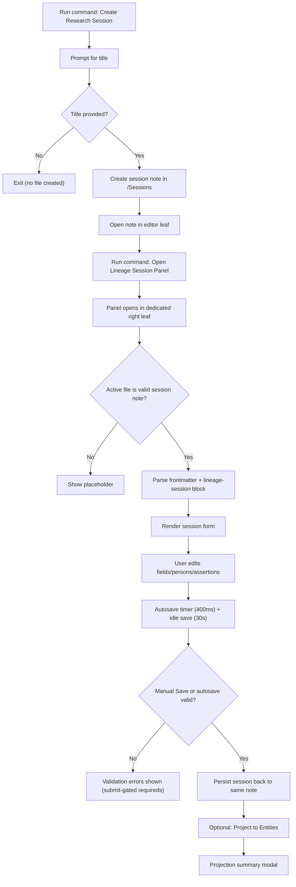

# Session Management Flow (Current State)

## Scope
This document captures the **current implemented flow** for research session lifecycle in the Lineage plugin: create, open in panel, edit, save, and project.

Primary implementation references:
- `src/commands.ts`
- `src/main.ts`
- `src/views/session-view.ts`
- `src/session-manager.ts`

## User Flow Overview

### Flow 1: Create new research session
1. User runs `Create Research Session`.
2. Title modal opens.
3. If title is non-empty, session file is created and opened.
4. Current implementation creates files under hardcoded `Sessions/`.

### Flow 2: Open/manage session in docked panel
1. User runs `Open Lineage Session Panel`.
2. Plugin opens or focuses a right-side session view leaf.
3. Panel listens to active file changes and metadata changes.
4. If active note has top frontmatter + closed `lineage-session` block, session loads.
5. Otherwise placeholder is shown (no error UI).

### Flow 3: Edit and save
1. User edits metadata/document/person/assertion fields.
2. Autosave is scheduled.
3. Manual save triggers submit-mode validation; autosave uses silent validation.
4. On valid data, note is rewritten via `vault.process`.
5. Save status updates inline (`Saving…`, `Saved ✓`, `Error ⚠`).

### Flow 4: Save + project
1. User clicks `Project to Entities` or uses `Cmd/Ctrl+Enter`.
2. Validation gates projection.
3. Projection engine runs and summary modal opens.
4. On failure, summary modal still opens with inline error and retry action.

## Flow Permutations Matrix

| Dimension | Variant | Current behavior |
|---|---|---|
| Session entry | Create command | Creates note then opens it |
| Session entry | Existing note from vault | Loads if valid structure present |
| Panel opening | First open | Creates right leaf view |
| Panel opening | Re-open command | Focuses existing session view |
| Active file validity | Valid research session | Parses and renders form |
| Active file validity | Non-session note | Placeholder shown |
| Save trigger | Manual button | Submit-mode validation and save |
| Save trigger | Autosave (input) | Silent validation and save |
| Save trigger | Idle autosave | Silent validation and save |
| Projection trigger | Button | Validate then project |
| Projection trigger | Cmd/Ctrl+Enter | Save, then project if valid |
| Failure mode | Parse failure (candidate note) | Error UI / notice depending on parse failure type |
| Failure mode | Save failure | Notice + error status |
| Failure mode | Projection failure | Summary modal with error and retry |

## Missing Elements & Gaps

### Category: Foldering / Configuration
- **Gap Description:** Session creation uses hardcoded `Sessions/` folder rather than configured base folder.
- **Impact:** Inconsistent organization vs user settings; portability friction.
- **Current Ambiguity:** Whether sessions should live in base folder root, base subfolder (for example, `Lineage/Sessions`), or dedicated configurable folder.

### Category: Save Validation Contract
- **Gap Description:** Autosave is blocked by silent validation failures but user feedback may be minimal until manual submit.
- **Impact:** Users may assume data is saved when it is not.
- **Current Ambiguity:** Whether autosave failures should always surface visible global warning.

### Category: Keyboard Shortcut Ownership
- **Gap Description:** Save/project and add-assertion shortcuts are hardcoded in view event handling.
- **Impact:** Can diverge from user-managed Obsidian hotkeys model.
- **Current Ambiguity:** Keep hardcoded for speed vs migrate to command-based configurable hotkeys.

### Category: Cross-Platform Verification
- **Gap Description:** Modifier behavior (`Cmd` vs `Ctrl`) has not been fully verified across OSes.
- **Impact:** Potential workflow break for non-macOS users.
- **Current Ambiguity:** Whether to require explicit Windows/Linux QA before sprint close.

### Category: Parse Candidate Heuristics
- **Gap Description:** Candidate detection requires frontmatter + closed code block before parse attempt.
- **Impact:** Reduces false errors but may skip malformed partial sessions without direct guidance.
- **Current Ambiguity:** Whether to show actionable fix hints for near-miss session notes.

## Critical Questions Requiring Clarification

### Critical
1. Where should newly created research sessions be stored by default: `Sessions/`, `Lineage/`, or `Lineage/Sessions/`?
- Why it matters: Affects every session creation and vault organization.
- Assumption if unanswered: Keep current `Sessions/` behavior until folder strategy is finalized.

2. Should autosave failure due to validation always show a global warning banner/status?
- Why it matters: Prevents false confidence that edits are persisted.
- Assumption if unanswered: Keep silent autosave validation for now and rely on manual save feedback.

### Important
3. Should current hardcoded shortcuts remain, or should session actions move to command-based hotkeys only?
- Why it matters: Impacts UX consistency with Obsidian conventions.
- Assumption if unanswered: Keep hardcoded shortcuts for Sprint 6 and revisit in later sprint.

4. Should “near-valid” session notes (for example, missing closing fence) show guided repair messaging?
- Why it matters: Reduces confusion when panel appears empty.
- Assumption if unanswered: Keep strict placeholder behavior.

### Nice-to-have
5. Should session save status include timestamp (`Saved 10:42`) for stronger persistence confidence?
- Why it matters: Improves trust for long transcription sessions.
- Assumption if unanswered: Keep current text-only status.

## Recommended Next Steps
1. Decide and implement session file location contract (see todo `012`).
2. Add explicit UI spec language for autosave failure visibility and save guarantees.
3. Add cross-platform shortcut QA signoff criteria to sprint acceptance checklist.
4. If keeping hardcoded shortcuts, document rationale in `ui-spec.md`; if not, move to command-based hotkeys in future sprint.
