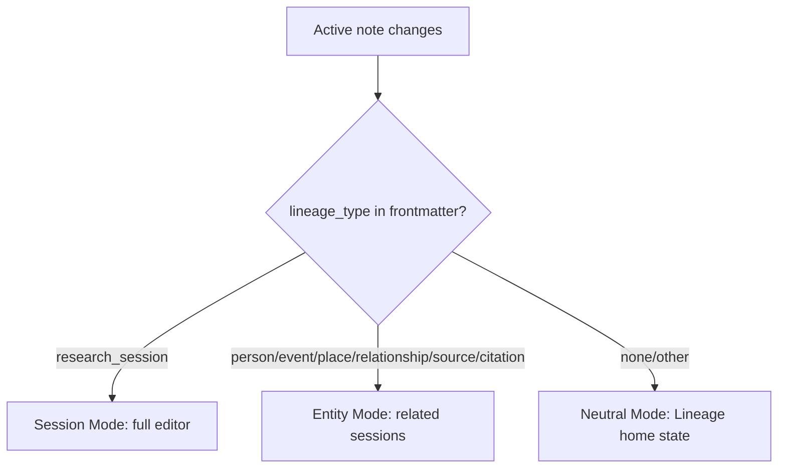

# Session View As Unified Main Viewer (Spec)

## Summary
Make the Lineage Session panel the single contextual viewer for Lineage notes, not only session notes.

Current behavior:
- On non-session notes, panel shows:
  - `No research session loaded`
  - `Open a research session note to view details here`

Target behavior:
- On a session note: show full Session editor (current behavior).
- On an entity note (person/event/place/relationship/source/citation): show related research sessions for that entity.
- On non-Lineage notes: show neutral Lineage context view (not session-only placeholder).

## Why
- Keeps one stable workspace surface for research, evidence, and entity navigation.
- Reduces context switching between note editor and research session exploration.
- Supports document-first workflow while still navigating entity-centric notes.

## Scope
### In scope
- Context-aware panel modes based on active note type.
- Entity-to-session relationship discovery and display.
- “Related sessions” list UI in panel for entity notes.
- Actions from entity mode:
  - Open related session
  - Create new session from entity context (prefill where possible)

### Out of scope
- Full redesign of session editor mode.
- New projection semantics.
- Session/entity merge tooling.

## Panel Modes

### Mode 1: Session Mode (existing)
- Parse and render full session editor.
- Save/project actions unchanged.

### Mode 2: Entity Mode (new)
- Header: active entity name/title.
- Section: `Related Research Sessions`.
- Each row shows:
  - Session title
  - Date (if available)
  - Repository + record type
  - Relevance reason (for example: “Projected this entity”)
- Row actions:
  - `Open session`
  - optional `Open source` (if derivable)
- Primary action:
  - `Create Research Session for this entity`

### Mode 3: Neutral Mode (new)
- Replace current “No research session loaded” message with a neutral Lineage state:
  - “No Lineage context for this note”
  - actions:
    - `Create Research Session`
    - `Open recent sessions`

## Entity → Session Relation Rules
Define “related session” with deterministic tiers.

### Tier 1 (required): Projected entity link match
Session is related if:
- Session frontmatter `projected_entities` resolves to the active entity file.

This is the most reliable relation and should be implemented first.

### Tier 2 (optional later): Lineage ID match
Session is related if:
- Resolved projected entity has `lineage_id` equal to active entity `lineage_id`.

Useful for resilience if filenames/paths change.

### Tier 3 (optional later): Derived relation from sources/citations
Session is related if:
- Citation/source evidence chain ties session to active entity.

More expensive and requires additional indexing; defer unless Tier 1 coverage is insufficient.

## Data/Indexing Strategy
To avoid full-vault scan on every leaf change:
- Maintain a lightweight session index:
  - `entityPath -> [sessionFilePath]`
  - optionally `entityLineageId -> [sessionFilePath]`
- Build/update index on:
  - plugin load
  - session file save/metadata change
  - projection updates
- Fallback: cold scan if index missing.

## UX Requirements
- Panel must not replace active editor tabs (right leaf behavior remains).
- Entity mode must render within 150ms for indexed lookup in typical vault sizes.
- Empty related-session list must show clear actions:
  - `No sessions linked to this entity yet.`
  - `Create session for this entity`

## Prefill Rules For “Create Session From Entity”
- Always prefill title with entity name + “Research”.
- If entity has lineage_type:
  - person: `Research - [Person Name]`
  - place: `Research - [Place Name]`
  - event: `Research - [Event Title]`
- Optionally prefill `projected_entities` with active entity wikilink at creation time.

## Edge Cases
- Entity note without frontmatter `lineage_id`: use file path/link matching only.
- Malformed session note in related list: show row with warning badge; still openable.
- Deleted/renamed related file: hide stale relation after index refresh.
- Multiple sessions per entity: sort newest first (session_date desc, fallback mtime).

## Accessibility
- Related sessions list keyboard navigable.
- Empty/error state text announced via standard live region patterns where needed.
- Mode changes should preserve focus predictably when active note changes.

## Acceptance Criteria
- [ ] Panel shows Session Mode on `lineage_type: research_session` notes.
- [ ] Panel shows Entity Mode on entity notes and lists related sessions (Tier 1).
- [ ] Panel shows Neutral Mode on non-Lineage notes.
- [ ] Related session row opens the selected session note.
- [ ] `Create Research Session for this entity` works from Entity Mode.
- [ ] Right-side panel behavior remains (does not replace editor tab).
- [ ] Performance acceptable with session index (no noticeable lag on note switch).

## Implementation Phases
### Phase 1
- Add mode detection + Entity Mode scaffold + Tier 1 relation lookup (simple scan acceptable).

### Phase 2
- Add session index/cache and sorting.
- Add create-from-entity prefill behavior.

### Phase 3
- Optional Tier 2/Tier 3 relation enrichment.

## Open Questions
1. Should “related” include sessions that reference entity only in assertion text but not projected_entities?
2. Should entity mode allow quick filters (open/closed sessions, date ranges)?
3. Should citation notes open entity mode or a citation-specific mode first?
