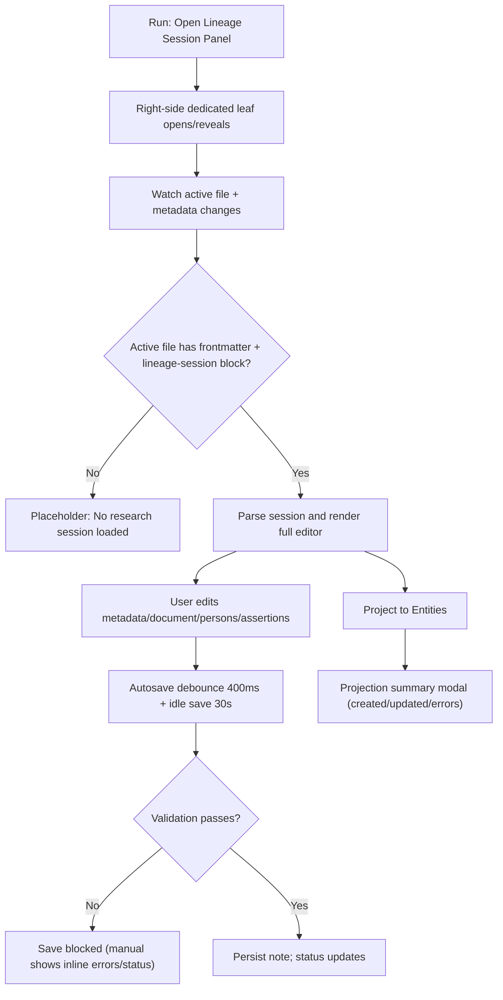

# Session UI Flow (Current State)

## Scope
This spec documents the currently implemented Lineage session panel UI, including rendered sections, modals, validation surfaces, keyboard behavior, and projection UX.

Primary references:
- `src/views/session-view.ts`
- `styles.css` (canonical session panel stylesheet)
- `src/main.ts`
- `src/commands.ts`

### User Flow Overview

Flow 1: Panel activation and context loading
1. `Open Lineage Session Panel` opens a dedicated right leaf or reveals existing one.
2. View listens to active-leaf changes and note metadata changes.
3. Non-candidate files show placeholder state.
4. Candidate files are parsed and rendered as session editor.
5. Parse failures show error state with message and notice.

Flow 2: Session editor structure
1. Header with session title.
2. `SOURCE METADATA` section:
- title, record type, repository, locator.
3. `DOCUMENT` section:
- URL input, file path input + `Browse`, transcription textarea.
4. `PERSONS IN SESSION` section:
- list with status (`✓ matched` or `⚠ unmatched`) and remove action.
- `Add person` button opens modal.
5. `ASSERTIONS` section:
- grouped by assertion type.
- each assertion in expandable details with delete action.
- warnings for missing participants or incomplete parent-child.
- `Add assertion` button opens modal.
6. Bottom actions:
- `Save session`
- `Project to Entities`
- inline save status text
- projection progress bar (delayed reveal)

Flow 3: Person management UX
1. Add person modal requires `Name`; `Sex` optional.
2. On add, person is appended and match modal opens immediately.
3. Match modal shows:
- default `Create new person (no match)` selected
- up to 5 candidates by score (if any)
- score breakdown (Name/Date/Place percentages)
4. Confirm candidate writes `matched_to = [[Candidate Name]]`; create-new keeps `matched_to = null`.
5. Remove person confirms via browser confirm dialog; assertion refs are cleaned in-memory.

Flow 4: Assertion management UX
1. Add assertion modal supports types:
- `identity`, `birth`, `death`, `marriage`, `parent-child`, `residence`, `freeform`.
2. Parent-child uses dedicated parent/child selects.
3. Other types use participant checkboxes.
4. Place input has autocomplete from indexed place notes.
5. Submission validation:
- parent-child: both roles required and must differ
- other types: at least one participant required
6. Added assertion appears immediately in grouped assertion list.

Flow 5: Save, validation, and projection UX
1. Manual save uses submit-mode validation and sets status.
2. Autosave is silent; invalid state is not persisted.
3. Validation checks:
- required metadata fields
- at least one document capture field (URL/file/transcription)
- URL format if provided
- file path resolves in vault if provided
4. Projection validates first (unless invoked from Cmd/Ctrl+Enter post-save path).
5. Projection result opens modal with created/updated/errors and retry option.

Flow 6: Keyboard behavior (implemented)
1. `Cmd/Ctrl+N` opens Add Assertion modal.
2. `Cmd/Ctrl+Enter` attempts manual save, then projection if valid.
3. Handled from session view keydown listener only when panel has focus.

### Flow Permutations Matrix

| Dimension | Variant | Current behavior |
|---|---|---|
| Panel open state | Existing session leaf exists | Reveals existing leaf |
| Panel open state | No session leaf exists | Creates right-side leaf |
| Active note context | Valid research session note | Full editor renders |
| Active note context | Non-session note | Placeholder renders |
| Active note context | Malformed candidate note | Error state + notice |
| Save trigger | Field edits | Debounced autosave |
| Save trigger | Add/remove person/assertion | Idle save scheduled |
| Save trigger | Manual button | Submit validation + status update |
| Validation mode | Silent | Blocks persistence without showing all errors |
| Validation mode | Submit | Shows all blocking errors |
| Person matching | Candidates above threshold | Ranked list (max 5) |
| Person matching | No candidates | Create-new only + "No matches found." |
| Assertion modal type | `parent-child` | Parent/child selectors shown |
| Assertion modal type | non-`parent-child` | Participants checklist shown |
| Projection outcome | Success | Summary modal with created/updated |
| Projection outcome | Failure | Summary modal with error + retry |
| Keyboard shortcut | Cmd/Ctrl+N | Add assertion modal |
| Keyboard shortcut | Cmd/Ctrl+Enter | Save then project |

### Missing Elements & Gaps

**Category**: Mode Coverage
- **Gap Description**: UI currently has Session mode and placeholder only; Entity mode and Neutral mode from prior spec are not implemented.
- **Impact**: Panel does not act as a unified Lineage viewer across entity notes.
- **Current Ambiguity**: Whether unified multi-mode behavior remains in current roadmap scope.

**Category**: Export UX
- **Gap Description**: No `Export` control exists in actions.
- **Impact**: Spec-promised workflow is unavailable in panel.
- **Current Ambiguity**: Whether export should be explicit button vs implicit “session note is export.”

**Category**: Conflict Indicators
- **Gap Description**: No conflict detection badge/tooltip is implemented.
- **Impact**: Users cannot quickly identify contradictory assertions in-panel.
- **Current Ambiguity**: Whether conflict analysis belongs in session view or projection/reporting step.

**Category**: Session Closing UX
- **Gap Description**: No dedicated close button in panel header.
- **Impact**: Users rely on Obsidian leaf controls, not panel-local affordance.
- **Current Ambiguity**: Whether close behavior should be explicit in panel UI.

**Category**: Locator Semantics
- **Gap Description**: Locator is only required non-empty text; no URL/file semantics enforced.
- **Impact**: Data quality may vary significantly.
- **Current Ambiguity**: Whether locator should accept free text, URL only, or URL/file with validation.

**Category**: Match Trigger Behavior
- **Gap Description**: Matching occurs on person add only; no explicit rematch action.
- **Impact**: Users cannot easily correct or refresh matches later.
- **Current Ambiguity**: Whether rematch should be per-person action, bulk action, or automatic.

**Category**: Autosave Feedback
- **Gap Description**: Silent autosave validation failures do not surface persistent global warning.
- **Impact**: Users may assume changes are saved when they are not.
- **Current Ambiguity**: Desired balance between non-intrusive UX and save-failure visibility.

### Critical Questions Requiring Clarification

1. **Critical**: Should SessionView continue as session-only UI, or must Entity/Neutral modes be implemented now?
- Why it matters: Determines primary panel architecture and navigation strategy.
- Assumption if unanswered: Keep session-only + placeholder behavior.
- Example ambiguity: active person note currently shows no related-session UX.

2. **Critical**: Is export functionality required in-panel for current release scope?
- Why it matters: User workflow and documentation alignment.
- Assumption if unanswered: Treat session note itself as export and omit button.
- Example ambiguity: spec says export exists; implementation has no export action.

3. **Critical**: Should conflict indicators be implemented in session UI before declaring UI spec complete?
- Why it matters: Data review quality for genealogical assertions.
- Assumption if unanswered: Keep current warning-only rendering for structurally incomplete assertions.
- Example ambiguity: conflicting birth dates currently show no dedicated conflict marker.

4. **Important**: Should locator input have stronger format validation?
- Why it matters: Source traceability consistency.
- Assumption if unanswered: Keep non-empty string requirement only.
- Example ambiguity: locator `"Box 3"` vs URL/file path accepted equally.

5. **Important**: Should person rows include rematch action/edit controls?
- Why it matters: Correctability for duplicate matching decisions.
- Assumption if unanswered: matching stays add-time only.
- Example ambiguity: no UI path to change `matched_to` except editing raw session note.

6. **Important**: Should autosave failure state be persistently visible outside manual save?
- Why it matters: prevents silent non-persistence.
- Assumption if unanswered: keep current status behavior.
- Example ambiguity: invalid URL blocks autosave without immediate obvious banner.

7. **Nice-to-have**: Should Add Assertion and Match modals preserve drafts across accidental close?
- Why it matters: reduces re-entry friction.
- Assumption if unanswered: keep current reset-on-close behavior.
- Example ambiguity: long citation snippet is lost on cancel/close.

8. **Nice-to-have**: Should keyboard shortcuts be moved to command-based configurable hotkeys?
- Why it matters: consistency with Obsidian keybinding expectations.
- Assumption if unanswered: keep view-local key handling.
- Example ambiguity: behavior varies if panel focus is not active.

### Recommended Next Steps
1. Decide canonical SessionView mode strategy (session-only vs unified multi-mode) and update acceptance criteria.
2. Align docs and implementation on export behavior (add button or remove requirement).
3. Define conflict-indicator contract (trigger conditions, visuals, and scope) before implementing.
4. Specify locator validation policy and update field-level validation accordingly.
5. Add rematch UX for existing persons (row action or batch refresh).
6. Add explicit autosave-failure signal if save guarantee clarity is required.

## Implemented Update (2026-02-12)

- Session validation now uses a shared evaluator consumed by SessionView, SessionManager, and command projection preflight.
- Locator format issues are warning-level only when locator appears URL-like; locator remains required.
- URL format issues for document URLs are warning-level only and do not block save.
- Autosave and manual save now surface persistent save-state failures with reason-aware messaging:
  - validation blocked (warning)
  - write failed (error)
- Person rows now include `Match`/`Rematch` actions so users can rerun matching after initial add.
- Projection summary now includes `Notes` to expose intentional non-projection cases (for example freeform assertions).
